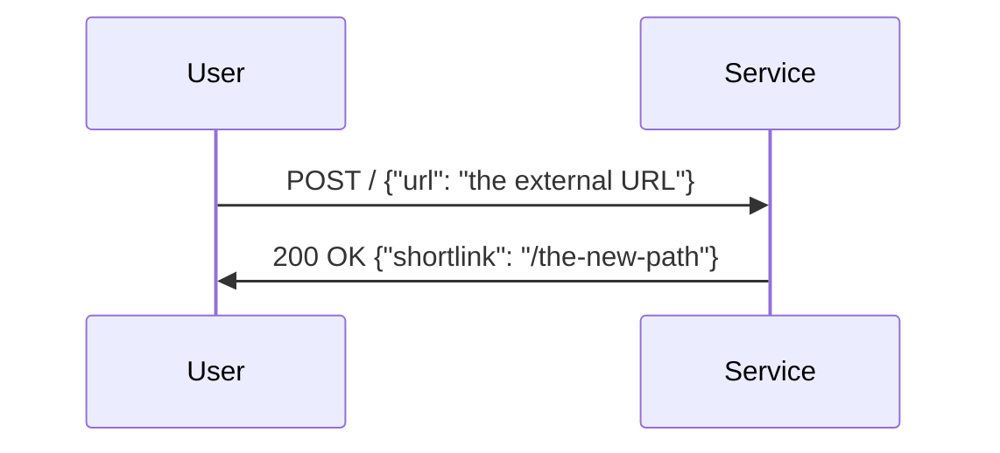
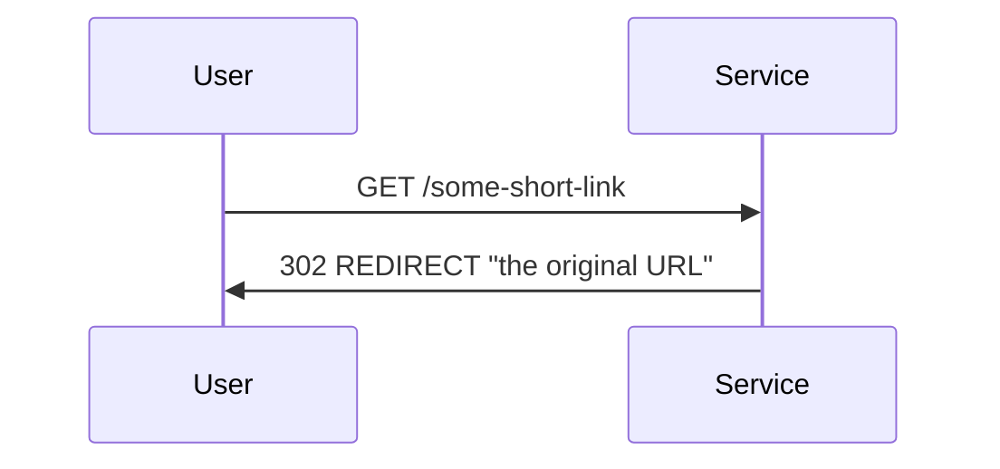

# Build a Serverless URL shortener

**Note**:
Please have a full read through of this exercise end to end, and please do raise questions before you begin!

Developing utility systems on top of cloud infrastructure components is a core
part of active infrastructure work and a great help for other development teams.

We would like you to architect, deploy and optimize a small service that allows
product managers to share short URLs. This utility should take no longer than
4 hours from concept to production.

## Prerequisites

Before starting the exercise, you should have the following completed:

- Installed NodeJS (latest version should be fine).
- Installed AWS SDK and logged locally in with your credentials.
- A github account that can create public repositories.

## Before you start

- AWS offers a generous free tier for the services you might need to leverage.
- Your submission should not include code that you do not own (open source code is allowed).
  **This will result in immediate disqualification.**
- It is **not** required to submit a deployed endpoint, but some _proof of correctness_
  will be needed.

## Objective 1: The Functionality

The actual software service only has two actions that need to be implemented.

One HTTP action to register new URLs, which rolls some random short string,
persists it together with the associated URL somehow and ultimately returns
the random string as the service path to share with the world:

And another HTTP action to resolve a given shortlink:

The choice of technology is yours, however Javascript or even Typescript would be
ideal. Keep in mind that this _will_ need to run on AWS Lambda in the next step.

## Objective 2: The Deployment

Define a **Github Action** that automatically deploys the above code to
**AWS Lambda** by leveraging **AWS CDK**.
These three technology choices are _non-negotiable_ for this challenge.

The endpoint(s) must be callable with a configurable (at deployment time)
custom URL, since having _short_ URLs is a key business priority.

You will need to use additional AWS infrastructure components, please explain
your choices.

Note: stopping the GHA after `cdk synth` is sufficient to emulate deployment.

## Objective 3: The Operations

Without changing the functionality of the service, how to:

- guarantee handling of traffic bursts with over 9000 parallel requests?
- minimize monthly cloud provider costs as much as possible?
- protect the POST action so that only our administrators can submit URLs?

Optimize your repository to accommodate for these operational goals.

## Submission

We expect you to submit/link a dedicated github repository containing the
code, github action and a concise README so _other developers_ can pick up the
ball easily in case more features are needed. Link to a properly deployed
version of your code is a big plus.